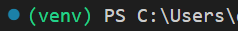
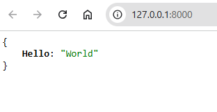
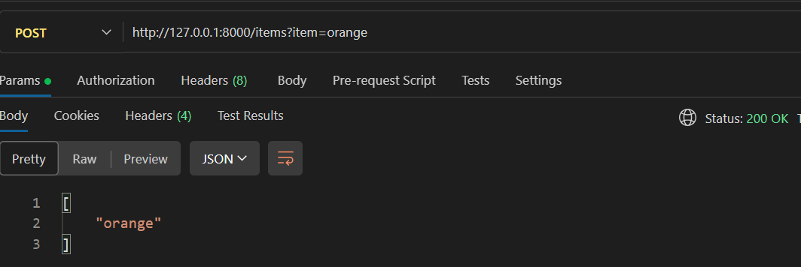
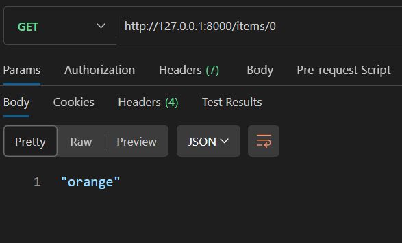
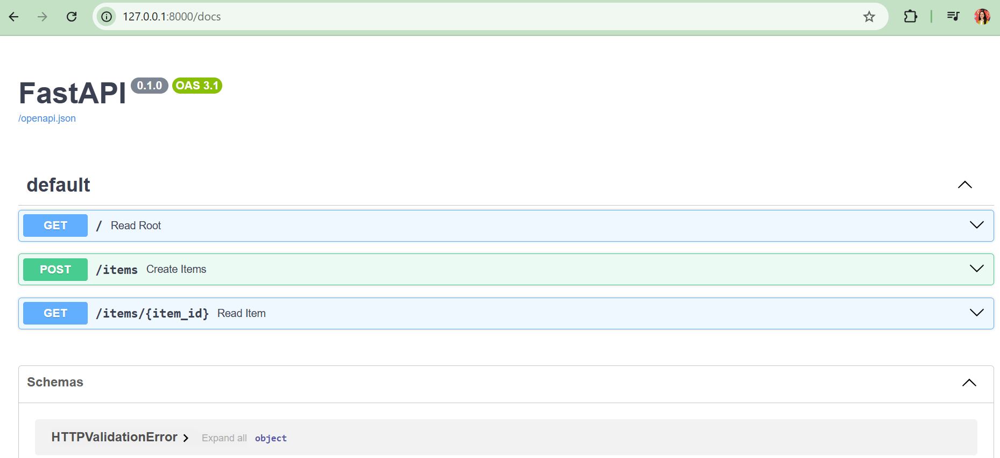

¿¿cooodeamosss yaaa??

¡Comenzamoos!
Crea tu carpeta para tu nuevo proyecto `📁hello-fastAPI` y abrela en tu editor de código

*Para poder realizar este proyecto necesitas tener python instalado en tu ordendor.

### Creamos el entorno

<aside>
    
    🗣  entorno virtual + instalaciones

</aside>

1️⃣ Necesitamos crear **un entorno** para guardar todos los paquetes necesarios de Python.

Lo harás creando una carpeta venv, si no todo se te instalara de manera global en tu ordenador.

`venv` es el módulo estándar de Python que permite **crear entornos virtuales**

Se crea todito todo con este comando👇

```bash
python -m venv venv
```

si estas haciendo control de versión recuerda crear un `.gitignore` y nombrar `venv/`

Para poder activar este entorno escribe lo siguiente en tu consola PoweShell

```powershell
venv\Scripts\Activate.ps1
```

Sabrás que está activado porqué en tu terminal verás:



2️⃣ Con tu `venv` ya activado instalamos fastapi y uvicorn

```powershell
pip install fastapi uvicorn
```

Si vas a compartir este repositorio no olvides crear un archivo `requirements.txt`

```powershell
pip freeze > requirements.txt
```

si quieres hacerlo de una forma muy similar a la gestión de paquetes de npm recomiendan [Poetry](https://python-poetry.org/), Yo aún no lo conozco pero tengo ganas, seguro queda todo muy ordenadito✨

Bueno Continuamos… dejo por aquí los comandos que harían falta para las personas que después quisieran clonar vuestro respositorio y hacerlo funcionar, los clásicos pasos de instalación del readme...

- Los comandos que tendrá que seguir la persona que se descargue este repo serán:
    
    ```powershell
    python -m venv venv
    source venv/Scripts/activate  # En Windows (o venv\Scripts\activate en CMD)
    pip install -r requirements.txt
    ```
    

Ahora que ya tenemos el entorno creado…

### Comenzamos con la API

vamos a crear nuestro archivo `main.py`

¿Qué vamos a aprender?

<aside>

    🗣 Método GET + POST + Manejo de errores + Modelos
</aside>

### Ruta para el Método GET

Lee los comentarios, allí encontrarás comparaciones con Js

```python
from fastapi import FastAPI

# instanciamos FastAPI
# en Js sería: const app = new FastAPI();
app = FastAPI()

# definimos una ruta
# estamos usando el decorador @app.get("/") para asociar la función read_root() con la ruta /.
# los decoradores son funciones que envuelven otras funciones
# en Js sería: app.get("/", (req, res) => res.send({ Hello: "World" }));
@app.get("/")
def read_root():
    return {"Hello": "World"}
```

¿ Qué hemos aprendido de Python? : **instanciar clases y decoradores.**

Vamos a ejecutar en terminal el comando para levantar nuestra API

```powershell
uvicorn main:app --reload
```

nos levanta el servidor local y ¡¡¡yupi ahí lo tenemos 🥳!!



bien, vamos a por la siguiente ruta

### Ruta para el Método POST

```python
# vamos a crear un array vacío para poder tener algún sitio donde postear algo, ya que aún no tenemos la base de datos
items = [] 

# definimos una ruta con un método POST
@app.post("/items")
def create_items(item: str):
    items.append(item)
    return items
```

vamos a testearlo con Postman pasándole la info por url



### Ruta para el Método GET by ID

ahora vamos a crear un GET por id

```python
@app.get("/items/{item_id}")
def read_item(item_id: int) -> str:
    return items[item_id]
```

Antes de hacerlo como lo estamos haciendo con un array hay que volver a rellenarlo haciendo un POST, porqué cada vez que volvemos hacer un cambio en el archivo main.js y guardamos el servidor se reinicia y el array vuelve a estar vacío, es decir, hay que repetir lo del paso anterior.



### **Manejo de errores**

1️⃣ Importamos HTTPException de FastAPI

```python
from fastapi import FastAPI , 👉 HTTPException

```

2️⃣Generamos el código utilizando el método HTTPException dentro de un raise

de nuevo lee los comentarios para ver la comparación con Js

```python
# definimos una ruta con un método GET por Id
@app.get("/items/{item_id}")
def read_item(item_id: int) -> str:
    # si el item existe lo devolvemos
    if item_id < len(items):
        return items[item_id]
    # si el item no existe lanzamos un error
    else:
        # raise se utiliza para lanzar una excepción de forma explícita en Python.
        # En js sería: throw new Error()
        # f"{}" es un string literal en Python
        # En js sería: `${}`
       👉 raise HTTPException(status_code=404, detail= f"Item {item_id} not found")
```

### Modelos

 importamos BaseModel de pydantic

```python
from pydantic import BaseModel

```

```python
# creamos el Modelo a partir de BaseModel de Pydantic
# En Js sería: Item extends BaseModel {}
class Item(BaseModel):
    text: str = None
    is_done: bool = False
```

La estructura de los datos que responde nuestra API ahora seguirá la estructura del modelo. Ahora pasamos a tipar todo con nuestra nueva interfaz `Item`. Digo interfaz porque vengo de TypeScript en Python sería más correcto decir:

“tipamos  usando nuestro esquema de validación `Item`" o ”pasamos a definir todo con nuestro modelo de datos `Item` basado en `BaseModel`"

```python
@app.post("/items")
def create_item(item: 👉 Item):
    items.append(item)
    return items

@app.get("/items", response_model=list[👉Item])
def list_items(limit: int = 10):
    return items[0:limit]

@app.get("/items/{item_id}",👉 response_model=Item)
def get_item(item_id: int) -> Item:
    if item_id < len(items):
        return items[item_id]
    else:
        raise HTTPException(status_code=404, detail=f"Item {item_id} not found")
```

 Ahora nuestras response en json será de este tipo:

```json
{
  "text": "Conociendo FastAPI",
  "is_done": true
}
```

### **Documentación**

Magia potagia haciendo documentaciones con Swagger desde FastApi

Basta con que pongas en la ruta del puerto que tienes levantado `/docs`

[http://127.0.0.1:8000/docs#](http://127.0.0.1:8000/docs#) 



Este pequeño ejercicio esta basado en [este tutorial](https://www.youtube.com/watch?v=iWS9ogMPOI0), cuando tenga más tiempo me gustaría editar el proyecto un poco más y hacerlo si puede ser aún más sencillo y enfocado hacía JavaScript, gracias por llegar hasta aquí ¡Seguimos aprendiendo!
